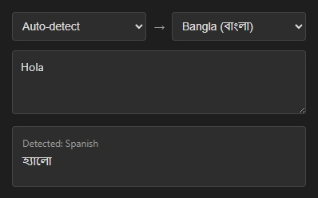

# Quick Translate Extension

 

A lightweight Chrome extension for instant translation, ideal for everyday browsing and low-volume personal use.

---

## Features

- **Instant Translation** – Translates as you type  
- **Select & Translate** – Translate selected text on any webpage  
- **Language Detection** – Auto-detects source language when using “Auto”  
- **Multiple Languages** – Supports 13 languages including English, Bangla, Spanish & more
- **Alternative Translations** – Displays alternative suggestions when available    
- **Dark Mode** – Elegant interface that's easy on the eyes  
- **Lightweight** – Fast and minimal UI focused on usability

---

## Installation

1. Download this repository (Click **Code → Download ZIP**)  
2. Extract the ZIP file  
3. Open Chrome and navigate to `chrome://extensions/`  
4. Enable **Developer mode** (toggle in top-right corner)  
5. Click **Load unpacked**  
6. Select the extracted folder  
7. The extension icon will appear in your toolbar

---

## How to Use

- Click the extension icon  
- Type or paste text (or select text on a webpage first)  
- See the translation instantly  
- Change languages using the dropdown menus

---

## Privacy

- This extension does not collect any user data
- Your translation history is not saved
- No API key is required or stored

---

## Supported Languages

Bangla, English, Spanish, French, German, Italian,  Portuguese, Russian, Japanese, Korean, Chinese, Arabic, Hindi

---

## Disclaimer

This extension is intended for **personal or low-volume use only**.  
For production-grade applications, consider using the **official Google Cloud Translation API**.

---

_Made with ❤️ for efficient browsing_
